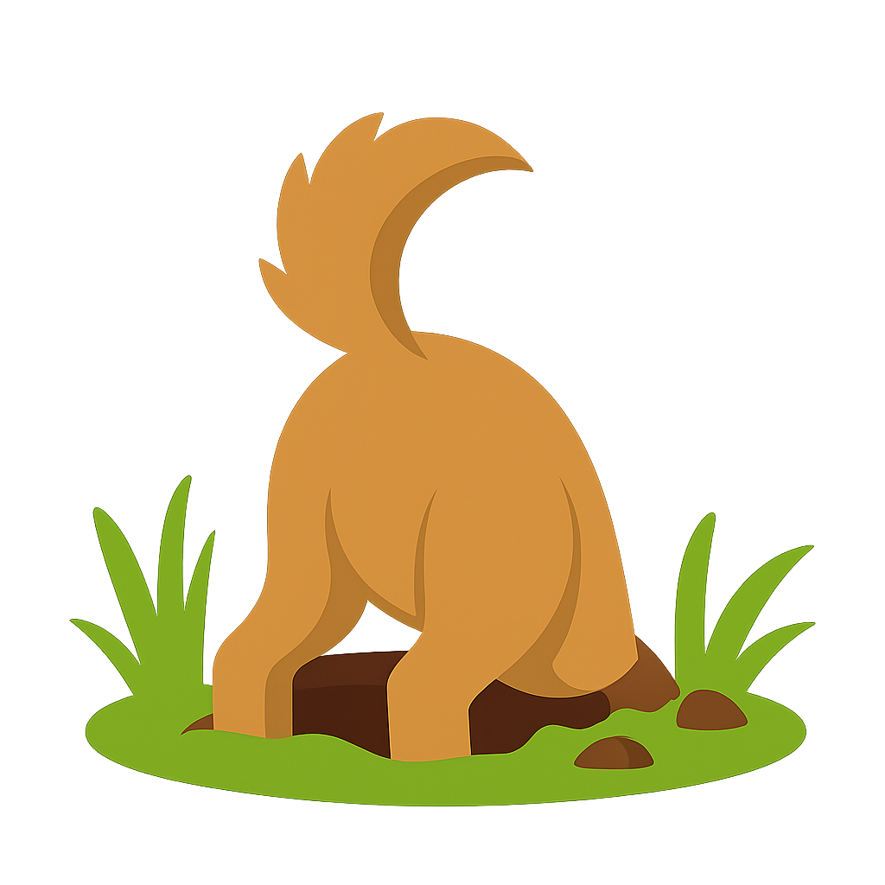

# Electron Archaeologist

> Digging up and comparing your artifacts since 2018

This bot generates diffs for every PR to `electron/electron` for the generated
`electron.d.ts` file so that reviewers checking docs changes can see easily
whether or not the typings file was generated correctly.

## How?

Check out the code, basically we spin up custom circleci jobs that store the
"before" and "after" `electron.d.ts` files as artifacts, compare them and then
post the results using the github checks API.
